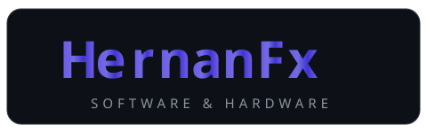
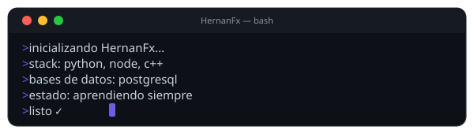
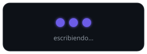

  

 

  

  <em>Estudiante de Ingeniería de Sistemas · Apasionado por sistemas y soluciones tecnológicas</em>

 

  

 

  <picture>
    <source media="(prefers-color-scheme: dark)" srcset="https://readme-typing-svg.demolab.com?font=Poppins&size=38&pause=800&color=C9D1D9&center=true&vCenter=true&width=800&lines=Hernan+Felix;Software+%26+Hardware;Sistemas+%26+Soluciones+Tecnol%C3%B3gicas">
    
  </picture>

 

  <table border="0" cellpadding="0" cellspacing="0" style="border-collapse: collapse; border: none;">
    <tr style="border: none;">
      <td style="border: none; padding-right: 12px; vertical-align: middle;">
        
      </td>
      <td style="border: none; vertical-align: middle;">
        <h2 style="font-family: 'Arial Black', Arial, sans-serif; font-size: 30px; font-weight: 900; letter-spacing: 1px; color: #6C5CE7; margin: 0; font-variant: small-caps;">Sobre Mí</h2>
      </td>
      <td style="border: none; padding-left: 12px; vertical-align: middle;">
        
      </td>
    </tr>
  </table>

 

  
  👨‍💻 Estudiante de Ingeniería de Sistemas apasionado por el desarrollo de software 
  ⚙️ Interesado en backend, estructuras de datos y bases de datos 
  📚 Siempre aprendiendo nuevas tecnologías y frameworks 
  🧠 Apasionado por la resolución de problemas con nuevas tecnologías 
  🚀 Enfocado en crear sistemas eficientes y escalables 
  💼 Abierto a oportunidades de trabajo o prácticas 
  📚 Actualmente: Python · C++ · Node.js · PostgreSQL

 

  

 

  <table border="0" cellpadding="0" cellspacing="0" style="border-collapse: collapse; border: none;">
    <tr style="border: none;">
      <td style="border: none; padding-right: 12px; vertical-align: middle;">
        
      </td>
      <td style="border: none; vertical-align: middle;">
        <h2 style="font-family: 'Arial Black', Arial, sans-serif; font-size: 25px; font-weight: 900; letter-spacing: 1px; color: #6C5CE7; margin: 0; font-variant: small-caps;">Lenguajes y Herramientas</h2>
      </td>
      <td style="border: none; padding-left: 12px; vertical-align: middle;">
        
      </td>
    </tr>
  </table>

 

  <code></code>
  <code></code>
  <code></code>
  <code></code>
  <code></code>
  <code></code>
  <code></code>
  <code></code>
  <code></code>
  <code></code>

 

  

 

  <table border="0" cellpadding="0" cellspacing="0" style="border-collapse: collapse; border: none;">
    <tr style="border: none;">
      <td style="border: none; padding-right: 12px; vertical-align: middle;">
        
      </td>
      <td style="border: none; vertical-align: middle;">
        <h2 style="font-family: 'Arial Black', Arial, sans-serif; font-size: 25px; font-weight: 900; letter-spacing: 1px; color: #6C5CE7; margin: 0; font-variant: small-caps;">Mi Stack</h2>
      </td>
      <td style="border: none; padding-left: 12px; vertical-align: middle;">
        
      </td>
    </tr>
  </table>

 

  

 

  <table border="0" cellpadding="0" cellspacing="0" style="border-collapse: collapse; border: none;">
    <tr style="border: none;">
      <td style="border: none; padding-right: 12px; vertical-align: middle;">
        
      </td>
      <td style="border: none; vertical-align: middle;">
        <h2 style="font-family: 'Arial Black', Arial, sans-serif; font-size: 25px; font-weight: 900; letter-spacing: 1px; color: #6C5CE7; margin: 0; font-variant: small-caps;">Contribuciones</h2>
      </td>
      <td style="border: none; padding-left: 12px; vertical-align: middle;">
        
      </td>
    </tr>
  </table>

 

  

 

  <table border="0" cellpadding="0" cellspacing="0" style="border-collapse: collapse; border: none;">
    <tr style="border: none;">
      <td style="border: none; padding-right: 12px; vertical-align: middle;">
        
      </td>
      <td style="border: none; vertical-align: middle;">
        <h2 style="font-family: 'Arial Black', Arial, sans-serif; font-size: 25px; font-weight: 900; letter-spacing: 1px; color: #6C5CE7; margin: 0; font-variant: small-caps;">Contacto</h2>
      </td>
      <td style="border: none; padding-left: 12px; vertical-align: middle;">
        
      </td>
    </tr>
  </table>

 

  

    

      📫 ¡Hablemos!
    

    

      ⚡ Abierto a prácticas y oportunidades laborales
    

    <a href="https://github.com/HernanFx" target="_blank" style="display:inline-flex; align-items:center; gap:10px; background:#181717; color:#FFFFFF; font-family:'Segoe UI',Arial,sans-serif; font-size:16px; font-weight:700; padding:12px 24px; border-radius:12px; margin:6px; text-decoration:none;">
      <svg viewBox="0 0 24 24" width="20" height="20" fill="#FFFFFF" aria-hidden="true"><path d="M12 .297c-6.63 0-12 5.373-12 12 0 5.303 3.438 9.8 8.205 11.385.6.113.82-.258.82-.577 0-.285-.01-1.04-.015-2.04-3.338.724-4.042-1.61-4.042-1.61C4.422 18.07 3.633 17.7 3.633 17.7c-1.087-.744.084-.729.084-.729 1.205.084 1.838 1.236 1.838 1.236 1.07 1.835 2.809 1.305 3.495.998.108-.776.417-1.305.76-1.605-2.665-.3-5.466-1.332-5.466-5.93 0-1.31.465-2.38 1.235-3.22-.135-.303-.54-1.523.105-3.176 0 0 1.005-.322 3.3 1.23.96-.267 1.98-.399 3-.405 1.02.006 2.04.138 3 .405 2.28-1.552 3.285-1.23 3.285-1.23.645 1.653.24 2.873.12 3.176.765.84 1.23 1.91 1.23 3.22 0 4.61-2.805 5.625-5.475 5.92.42.36.81 1.096.81 2.22 0 1.606-.015 2.896-.015 3.286 0 .315.21.69.825.57C20.565 22.092 24 17.592 24 12.297c0-6.627-5.373-12-12-12"/></svg>
      GitHub
    </a>

    <a href="https://linkedin.com/in/HernanFx" target="_blank" style="display:inline-flex; align-items:center; gap:10px; background:#0A66C2; color:#FFFFFF; font-family:'Segoe UI',Arial,sans-serif; font-size:16px; font-weight:700; padding:12px 24px; border-radius:12px; margin:6px; text-decoration:none;">
      <svg viewBox="0 0 24 24" width="20" height="20" fill="#FFFFFF" aria-hidden="true"><path d="M20.447 20.452h-3.554v-5.569c0-1.328-.027-3.037-1.852-3.037-1.853 0-2.136 1.445-2.136 2.939v5.667H9.351V9h3.414v1.561h.046c.477-.9 1.637-1.85 3.37-1.85 3.601 0 4.267 2.37 4.267 5.455v6.286zM5.337 7.433c-1.144 0-2.063-.926-2.063-2.065 0-1.138.92-2.063 2.063-2.063 1.14 0 2.064.925 2.064 2.063 0 1.139-.925 2.065-2.064 2.065zm1.782 13.019H3.555V9h3.564v11.452zM22.225 0H1.771C.792 0 0 .774 0 1.729v20.542C0 23.227.792 24 1.771 24h20.451C23.2 24 24 23.227 24 22.271V1.729C24 .774 23.2 0 22.222 0h.003z"/></svg>
      LinkedIn
    </a>

    <a href="" style="display:inline-flex; align-items:center; gap:10px; background:#EA4335; color:#FFFFFF; font-family:'Segoe UI',Arial,sans-serif; font-size:16px; font-weight:700; padding:12px 24px; border-radius:12px; margin:6px; text-decoration:none;">
      <svg viewBox="0 0 24 24" width="20" height="20" fill="#FFFFFF" aria-hidden="true"><path d="M24 5.457v13.909c0 .904-.732 1.636-1.636 1.636h-3.819V11.73L12 16.64l-6.545-4.91v9.273H1.636A1.636 1.636 0 0 1 0 19.366V5.457c0-2.023 2.309-3.178 3.927-1.964L5.455 4.64 12 9.548l6.545-4.91 1.528-1.145C21.69 2.28 24 3.434 24 5.457z"/></svg>
      Gmail
    </a>

  

