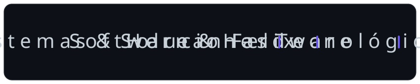

  

 

  

  <em>Estudiante de Ingeniería de Sistemas · Apasionado por sistemas y soluciones tecnológicas</em>

 

  <table border="0" cellpadding="0" cellspacing="0" style="border-collapse: collapse; border: none;">
    <tr style="border: none;">
      <td style="border: none; padding-right: 12px; vertical-align: middle;">
        
      </td>
      <td style="border: none; vertical-align: middle;">
        <h2 style="font-family: 'Arial Black', Arial, sans-serif; font-size: 30px; font-weight: 900; letter-spacing: 1px; color: #6C5CE7; margin: 0; font-variant: small-caps;">Sobre Mí</h2>
      </td>
      <td style="border: none; padding-left: 12px; vertical-align: middle;">
        
      </td>
    </tr>
  </table>

 

  
  👨‍💻 Estudiante de Ingeniería de Sistemas apasionado por el desarrollo de software 
  ⚙️ Interesado en backend, estructuras de datos y bases de datos 
  📚 Siempre aprendiendo nuevas tecnologías y frameworks 
  🧠 Apasionado por la resolución de problemas con nuevas tecnologías 
  🚀 Enfocado en crear sistemas eficientes y escalables 
  💼 Abierto a oportunidades de trabajo o prácticas 
  📚 Actualmente: Python · C++ · Node.js · PostgreSQL

 

  

 

  

 

  <table border="0" cellpadding="0" cellspacing="0" style="border-collapse: collapse; border: none;">
    <tr style="border: none;">
      <td style="border: none; padding-right: 12px; vertical-align: middle;">
        
      </td>
      <td style="border: none; vertical-align: middle;">
        <h2 style="font-family: 'Arial Black', Arial, sans-serif; font-size: 25px; font-weight: 900; letter-spacing: 1px; color: #6C5CE7; margin: 0; font-variant: small-caps;">Lenguajes y Herramientas</h2>
      </td>
      <td style="border: none; padding-left: 12px; vertical-align: middle;">
        
      </td>
    </tr>
  </table>

 

  <code></code>
  <code></code>
  <code></code>
  <code></code>
  <code></code>
  <code></code>
  <code></code>
  <code></code>
  <code></code>
  <code></code>

 

  

 

  <table border="0" cellpadding="0" cellspacing="0" style="border-collapse: collapse; border: none;">
    <tr style="border: none;">
      <td style="border: none; padding-right: 12px; vertical-align: middle;">
        
      </td>
      <td style="border: none; vertical-align: middle;">
        <h2 style="font-family: 'Arial Black', Arial, sans-serif; font-size: 25px; font-weight: 900; letter-spacing: 1px; color: #6C5CE7; margin: 0; font-variant: small-caps;">Mi Stack</h2>
      </td>
      <td style="border: none; padding-left: 12px; vertical-align: middle;">
        
      </td>
    </tr>
  </table>

 

  

 

  <table border="0" cellpadding="0" cellspacing="0" style="border-collapse: collapse; border: none;">
    <tr style="border: none;">
      <td style="border: none; padding-right: 12px; vertical-align: middle;">
        
      </td>
      <td style="border: none; vertical-align: middle;">
        <h2 style="font-family: 'Arial Black', Arial, sans-serif; font-size: 25px; font-weight: 900; letter-spacing: 1px; color: #6C5CE7; margin: 0; font-variant: small-caps;">Contribuciones</h2>
      </td>
      <td style="border: none; padding-left: 12px; vertical-align: middle;">
        
      </td>
    </tr>
  </table>

 

  

 

  <table border="0" cellpadding="0" cellspacing="0" style="border-collapse: collapse; border: none;">
    <tr style="border: none;">
      <td style="border: none; padding-right: 12px; vertical-align: middle;">
        
      </td>
      <td style="border: none; vertical-align: middle;">
        <h2 style="font-family: 'Arial Black', Arial, sans-serif; font-size: 25px; font-weight: 900; letter-spacing: 1px; color: #6C5CE7; margin: 0; font-variant: small-caps;">Contacto</h2>
      </td>
      <td style="border: none; padding-left: 12px; vertical-align: middle;">
        
      </td>
    </tr>
  </table>

 

  

    
📫 ¡Hablemos!

    
    
    
  

